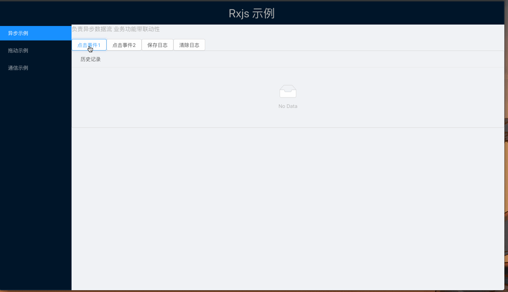

### 一个将`rxjs`和`react`结合使用的演示库

* 创建目的：尝试`rxjs 6`的操作符；锻炼函数式+响应式编程的思维方式；探索与`react`工程化结合方式
* 已包括
  - 在`pipe`中使用多个操作符组合操作数据
  - 演示在异步操作(多个异步组合)中的应用
  - 演示动画&游戏制作思路
  - 演示组件通信
* 已实现
  - 一种状态管理方式：高阶组件给调用者提供流式操作组件数据的方式
  - 父子组件&兄弟组件通信方式：在props中提供调用流的能力
* 待实现
  - 完整的`rxjs`状态管理方案

### license
MIT